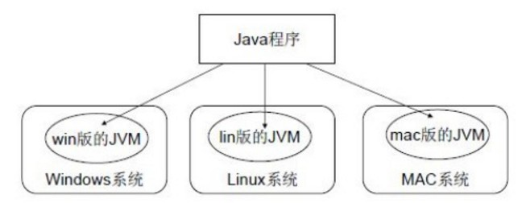

# days01【前言、入门程序、常量、变量】


## 今日内容

- Java语言的发展历史
- Java开发环境搭建
- 编写HelloWorld程序
- 常量和变量

<br/>


## 学习目标

- [x] 计算二进制和十进制数之间的互转 

- [x] 掌握常见的Terminal命令 

- [x] 理解Java语言的跨平台实现原理 

- [x] 理解JDK和JRE的组成和作用 

- [x] 配置环境变量JAVA_HOME

- [x] 编写HelloWorld程序编译并执行 

- [x] 理解关键字的含义

- [x] 理解标识符的含义 

- [x] 定义出所有类型的常量 

- [x] 理解Java中的基本数据类型分类 

- [x] 定义8种基本数据集类型的变量

<br/>


# 第一章 开发前言

## 1.1 Java语言概述

### 什么是Java语言
Java语言是美国Sun公司(Stanford University Network)，在1995年推出的**高级的编程语言**。

所谓编程语言，是计算机的语言，人们可以使用编程语言对计算机下达命令，让计算机完成人们需要的功能。

<br/>

### Java语言发展历史
- 1995年Sun公司发布Java1.0版本
- 1997年发布Java 1.1版本
- 1998年发布Java 1.2版本
- 2000年发布Java 1.3版本
- 2002年发布Java 1.4版本
- 2004年发布Java 1.5版本
- 2006年发布Java 1.6版本
- 2009年Oracle（甲骨文）公司收购Sun公司，并于2011发布Java 1.7版本
- 2014年发布**Java 1.8**版本
- 2017年发布Java 9.0版本
- 2018年3月发布Java10.0版本
- 2018年9月发布Java11.0版本
- 2019年3月发布Java12.0版本

目前Oracle6个月更新一次Java版本，毋庸置疑，Java越迭代，越多的新功能和特征就被增添。
由于工程可迁移性和维护性，我选择**Java1.8**学习和开发，相关Java新功能和特征做相关了解很快就能掌握。
注意：Oracle停止对Java商业免费使用的支持，以后可能选择其他产商的Java，这是后话，我们暂且不管。

<br/>

### Java语言能做什么
Java语言主要应用在互联网程序的开发领域。

常见的**互联网程序**比如天猫、京东、物流系统、网银系统等，以及**服务器后台处理**大数据的存储、查询、数据挖掘等也有很多应用。


<br/>

## 1.2 计算机基础知识

### 二进制

计算机中的数据不同于人们生活中的数据，人们生活采用十进制数，而计算机中全部采用二进制数表示，它只包含0、1两个数，逢二进一，1+1=10。每一个0或者每一个1，叫做一个bit(比特)。

下面了解一下十进制和二进制数据之间的转换计算。

- 十进制数据转成二进制数据:使用除以2获取余数的方式
- 二进制数据转成十进制数据:使用8421编码的方式


**二进制数系统中，每个0或1就是一个位，叫做bit(比特)。**

<br/>

### 字节
字节是我们常见的计算机中最小存储单元。计算机存储任何的数据，都是以字节的形式存储，右键点击文件属性，
我们可以查看文件的字节大小。
8个bit(二进制位) 0000-0000表示为1个字节，写成1 byte或者1 B。

- 8 bit = 1 B
- 1024 B =1 KB 
- 1024 KB =1 MB 
- 1024 MB =1 GB
-  1024 GB = 1 TB

<br/>

### 常用Terminal指令
Java语言的开发者，学习一些Terminal（终端）指令，将对编程有所帮助。

#### Mac/Linux Terminal指令
Mac Terminal指令和Linux类似，此处以Mac OS为例展示。

在你的应用程序中找到Terminal（终端），双击打开


<br/>

**MAC/LINUXTerminal指令**

| MAC/LINUX命令  | 操作符号                                                     |
| ---------------- | :----------------------------------------------------------- |
| 查看当前文件夹下 |  ls |
| 进入文件夹命令   | cd 文件夹名 |
| 退出文件夹命令   |  cd .. |
| 退出到系统根目录  | cd \ |
| 清屏            |  clear |

<br/>

#### Windows Terminal指令
按下Windows+R键盘，打开运行窗口，输入cmd回车，进入到DOS的操作窗口。

 


 


**Windows Terminal指令**

| DOS命令          | 操作符号                                                     |
| ---------------- | :----------------------------------------------------------- |
| 盘符切换命令     | 盘符名: |
| 查看当前文件夹   |  dir |
| 进入文件夹命令   | cd 文件夹名 |
| 退出文件夹命令   |  cd .. |
| 退出到磁盘根目录  | cd \ |
| 清屏            |  cls |

<br/>

# 第二章 Java语言开发环境搭建

## 2.1 Java虚拟机——JVM
- **JVM**(Java Virtual Machine ):Java虚拟机，简称JVM，是运行所有Java程序的假想计算机，是Java程序的运行环境，是Java 最具吸引力的特性之一。我们编写的Java代码，都运行在 JVM 之上。
- **跨平台**:任何软件的运行，都必须要运行在操作系统之上，而我们用Java编写的软件可以运行在任何的操作系 统上，这个特性称为Java语言的跨平台特性。该特性是由JVM实现的，我们编写的程序运行在JVM上，而JVM运行在操作系统上。


 

<br/>

## 2.2 JRE 和 JDK

- JRE (Java Runtime Environment) :是Java程序的运行时环境，包含 JVM 和运行时所需要的 核心类库 。

- JDK (Java Development Kit):是Java程序开发工具包，包含 JRE 和开发人员使用的工具。

我们想要运行一个已有的Java程序，那么只需安装` JRE` 即可。 

我们想要开发一个全新的Java程序，那么必须安装` JDK` 。

 


三者关系: JDK $\supseteqq$ JRE  $\supseteqq$ JVM

<br/>

## 2.3 JDK安装及配置

### mac JDK安装及配置

<a href="https://www.cnblogs.com/ostrich-sunshine/p/8414677.html">mac JDK安装及配置教程</a>

<br/>

### windows JDK安装及配置

<a href="https://www.bilibili.com/video/av62541169/?p=8">windows JDK的下载及安装</a>

<a href="https://www.bilibili.com/video/av62541169/?p=9">windows 环境配置</a>

<br/>

### 配置环境变量的作用 

开发Java程序，需要使用JDK中提供的工具，工具在JDK9安装目录的 bin 目录下。 

为了开发方便，我们想在**任意的目录下都可以使用JDK的开发工具**，则必须要配置环境变量。

配置环境变量的意义 在于告诉操作系统，我们使用的JDK开发工具在哪个目录下。

<br/>


# 第三章 HelloWorld入门程序

## 3.1 程序开发步骤说明

开发环境已经搭建完毕，可以开发我们第一个Java程序了。

Java程序开发三步骤:编写、编译、运行。

 

<br/>

## 3.2 编写Java源程序

1. 在指定目录下新建文本文件，完整的文件名修改为 HelloWorld.java ，其中文件名为 HelloWorld ，后缀名必须为 .java 。

2. 用文本编辑器（例如Sublimetext）打开HelloWorld.java。

3. 在文件中编写代码·并保存，代码如下:

```java
public class HelloWorld {
  public static void main(String[] args) {
		System.out.println("Hello, World!!!");
}
```
文件名必须是 HelloWorld ，保证文件名和类的名字是一致的，注意大小写。
 每个字母和符号必须与示例代码一模一样。
第一个 HelloWord 源程序就编写完成了，但是这个文件是程序员编写的，JVM是看不懂的，也就不能运行，因此我们必须将编写好的 Java源文件 编译成JVM可以看懂的`字节码文件` 。

<br/>

## 3.3 编译Java源文件

在Teminal中，进入Java源文件的目录，使用 javac 命令进行编译。

命令:

``javac Java源文件名.后缀名`

举例:

`javac HelloWorld.java`

编译成功后，命令行没有任何提示。

打开 d:\day01 目录，发现产生了一个新的文件 HelloWorld.class ，该文件就是编译后的文件，是Java的可运行文件，称为**字节码文件**，有了字节码文件，就可以运行程序了。

Java源文件的编译工具 javac.exe ，在JDK安装目录的bin目录下。但是由于配置了环境变量，可以再任意目 录下使用。

<br/>

## 3.4 运行Java程序

在Teminal中，进入Java源文件的目录，使用 java 命令进行运行。

命令:

`java 类名字`

举例:

`java HelloWorld`

java HelloWord **不要加** **不要加** **不要加** .class


Java程序 .class文件 的运行工具 java.exe ，在JDK安装目录的bin目录下。但是由于配置了环境变量，可 以再任意目录下使用。


<br/>

## 3.5 入门程序说明

### 编译与运行

- 编译:是指将我们编写的Java源文件翻译成JVM认识的class文件，在这个过程中， javac 编译器会检查我们所写的程序是否有错误，有错误就会提示出来，如果没有错误就会编译成功。
- 运行:是指将 class文件 交给JVM去运行，此时JVM就会去执行我们编写的程序了。

### 关于main方法

main方法:称为主方法。写法是固定格式不可以更改。main方法是程序的入口点或起始点，无论我们编写多少程序，JVM在运行的时候，都会从main方法这里开始执行。

<br/>

## 3.6 添加注释comment

注释:就是对代码的解释和说明。其目的是让人们能够更加轻松地了解代码。为代码添加注释，是十分必须 要的，它不影响程序的编译和运行。

Java中有单行注释和多行注释 单行注释以 //开头 换行结束

多行注释以 /*开头 以*/结束

<br/>

## 3.7 关键字keywords

关键字:是指在程序中，Java已经定义好的单词，具有特殊含义。

- HelloWorld.java中，出现的关键字有 public 、 class 、 static 、 void 等，这些单词已经被Java定义好，全部都是小写字母，notepad++中颜色特殊。 
- 关键字比较多，不能死记硬背，学到哪里记到哪里即可。

<br/>

## 3.8 标识符

标识符:是指在程序中，我们自定义的内容。比如类的名字、方法的名字和变量的名字等，例如HelloWorld.java中，出现的标识符有类名字 HelloWorld 。

- 命名规则（**硬性要求**）
	- 标识符可以包含 英文字母26个(区分大小写) 、 0-9数字 、 $(美元符号) 和 _(下划线) 。 
  - 标识符不能以数字开头。
- 标识符不能是关键字。
	
- 命名规范（**软性建议**）

  - 类名规范:首字母大写，后面每个单词首字母大写(大驼峰式)。 
  - 方法名规范: 首字母小写，后面每个单词首字母大写(小驼峰式)。 
  - 变量名规范:全部小写。

<br/>

# 第四章 常量

## 4.1 常量概述
**常量**是指在Java程序运行过程中固定不变的数据。

<br/>

## 4.2 分类
| 类型       | 含义                                   | 数据举例                    |
| ---------- | -------------------------------------- | --------------------------- |
| 整数常量   | 所有的整数                             | 0，1， 567， -9             |
| 小数常量   | 所有的小数                             | 0.0， -0.1， 2.55           |
| 字符常量   | 单引号引起来,只能写一个字符,必须有内容 | 'a'，''， '好'              |
| 字符串常量 | 双引号引起来,可以写多个字符,也可以不写 | "A" ，"Hello" ，"你好" ，"" |
| 布尔常量   | 只有两个值：true、false。(在流程控制中使用) | true ， false               |
| 空常量     | 只有一个值，代表没有任何数据(引用数据类型默认为null) | null                        |

<br/>

## 4.3 各类型常量代码示例

```java
public class ConstDemo {
	public static void main(String[] args) {
		// 字符串常量
		System.out.println("ABC");
		System.out.println(""); // 字符串两个双引号中间的内容为空
		System.out.println("XYZ");
		
		// 整数常量
		System.out.println(30);
		System.out.println(-500);
		
		// 浮点数常量（小数）
		System.out.println(3.14);
		System.out.println(-2.5);
		
		// 字符常量
		System.out.println('A');
		System.out.println('6');
		// System.out.println(''); // 两个单引号中间必须有且仅有一个字符，没有不行。
		// System.out.println('AB'); // 两个单引号中间必须有且仅有一个字符，有两个不行。
		
		// 布尔常量
		System.out.println(true);
		System.out.println(false);
		
		// 空常量。空常量不能直接用来打印输出。
		// System.out.println(null);
	}
}
```

<br/>

# 第五章 变量和数据类型

## 5.1 变量概述

在程序运行过程中固定不变的内容是常量，而可以发生改变的量称为变量。


- 数学中，可以使用字母代替数字运算,例如 x=1+5 或者 6=x+5。 
- 程序中，可以使用字母保存数字的方式进行运算，提高计算能力，可以解决更多的问题。比如x保存5，x也可以保存6，这样x保存的数据是可以改变的，也就是我们所讲解的变量。

Java中要求一个变量每次只能保存一个数据，必须要明确保存的数据类型。

<br/>

## 5.2 数据类型

数据类型分类Java的数据类型分为两大类:

- 基本数据类型:包括 整数、浮点数、字符、布尔。
- 引用数据类型:包括 类 、 数组 、 接口 。

<br/>

### 基本数据类型
**四类八种基本数据类型:**

| 数据类型     | 关键字       | 内存占用 | 取值范围               |
| ------------ | ------------ | -------- | ---------------------- |
| 字节型       | byte         | 1个字节  | -128~127               |
| 短整型       | short        | 2个字节  | -32768~32767           |
| 整型         | int(默认)    | 4个字节  | -231次方~2的31次方-1   |
| 长整型       | long         | 8个字节  | -2的63次方~2的63次方-1 |
| 单精度浮点数 | float        | 4个字节  | 1.4013E-45~3.4028E+38  |
| 双精度浮点数 | double(默认) | 8个字节  | 4.9E-324~1.7977E+308   |
| 字符型       | char         | 2个字节  | 0-65535                |
| 布尔类型     | boolean      | 1个字节  | true，false            |

<br/>

Java中的默认类型:整数类型是 int 、浮点类型是 double 。

<br/>

## 5.3 变量的定义及使用

### 格式

变量定义的格式包括三个要素: 数据类型 、 变量名 、 数据值 。

```java

// 创建一个变量并且赋值

// 先创建，后赋值
数据类型 变量名称; // 创建了一个变量
变量名称 = 数据值; // 赋值，将右边的数据值，赋值交给左边的变量

// 创建的同时进行赋值
数据类型 变量名称 = 数据值; // 在创建一个变量的同时，立刻放入指定的数据值
```

<br/>

### 示例代码


定义所有基本数据类型的变量，代码如下:
```java
public class VarDemo {
	public static void main(String[] args) {
		// 创建一个变量
		// 格式：数据类型 变量名称;
		int num1;
		// 向变量当中存入一个数据
		// 格式：变量名称 = 数据值;
		num1 = 10;
		// 当打印输出变量名称的时候，显示出来的是变量的内容
		System.out.println(num1); // 10
		
		// 改变变量当中本来的数字，变成新的数字
		num1 = 20;
		System.out.println(num1); // 20
		
		// 使用一步到位的格式来定义变量
		// 格式：数据类型 变量名称 = 数据值;
		int num2 = 25;
		System.out.println(num2); // 25
		
		num2 = 35;
		System.out.println(num2); // 35
		System.out.println("===============");
		
		byte num3 = 30; // 注意：右侧数值的范围不能超过左侧数据类型的取值范围
		System.out.println(num3); // 30
		
		// byte num4 = 400; // 右侧超出了byte数据范围，错误！
		
		short num5 = 50;
		System.out.println(num5); // 50
		
		long num6 = 3000000000L;
		System.out.println(num6); // 3000000000
		
		float num7 = 2.5F;
		System.out.println(num7); // 2.5
		
		double num8 = 1.2;
		System.out.println(num8); // 1.2
		
		char zifu1 = 'A';
		System.out.println(zifu1); // A
		
		zifu1 = '中';
		System.out.println(zifu1); // 中
		
		boolean var1 = true;
		System.out.println(var1); // true
		
		var1 = false;
		System.out.println(var1); // false
		
		// 将一个变量的数据内容，赋值交给另一个变量
		// 右侧的变量名称var1已经存在，里面装的是false布尔值
		// 将右侧变量里面的false值，向左交给var2变量进行存储
		boolean var2 = var1;
		System.out.println(var2); // false
	}
}
```

<br/>

### 注意事项

1. **如果创建多个变量，那么变量之间的名称不可以重复。**

2. 对于float和long类型来说，字母后缀F和L不要丢掉。
3. 如果使用byte或者short类型的变量，那么右侧的数据值不能超过左侧类型的范围。
4. **没有进行赋值的变量，不能直接使用；一定要赋值之后，才能使用。**
5. **变量使用不能超过作用域的范围。**
【作用域】：从定义变量的一行开始，一直到直接所属的大括号结束为止。
6. 可以通过一个语句来创建多个变量，但是一般情况不推荐这么写。

注意事项代码如下所示:
```java
public class VarNoticeDemo {
	public static void main(String[] args) {
		int num1 = 10; // 创建了一个新的变量，名叫num1
		// int num1 = 20; // 又创建了另一个新的变量，名字也叫num1，错误！
		
		int num2 = 20;
		
		int num3;
		num3 = 30;
		
		int num4; // 定义了一个变量，但是没有进行赋值
		// System.out.println(num4); // 直接使用打印输出就是错误的！
		
		// System.out.println(num5); // 在创建变量之前，不能使用这个变量
		
		int num5 = 500;
		System.out.println(num5); // 500
		
		{
			int num6 = 60;
			System.out.println(num6); // 60
		}
		// int num6;
		// System.out.println(num6); // 已经超出了大括号的范围，超出了作用域，变量不能再使用了
		
		// 同时创建了三个全都是int类型的变量
		int a, b, c;
		// 各自分别赋值
		a = 10;
		b = 20;
		c = 30;
		System.out.println(a); // 10
		System.out.println(b); // 20
		System.out.println(c); // 30
		
		// 同时创建三个int变量，并且同时各自赋值
		int x = 100, y = 200, z = 300;
		System.out.println(x); // 100
		System.out.println(y); // 200
		System.out.println(z); // 300
	}
}
```

<br/>